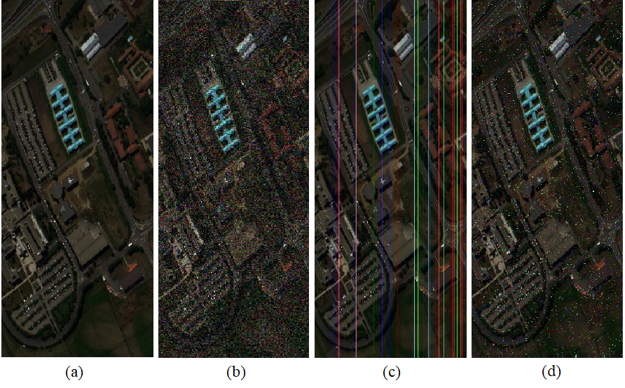
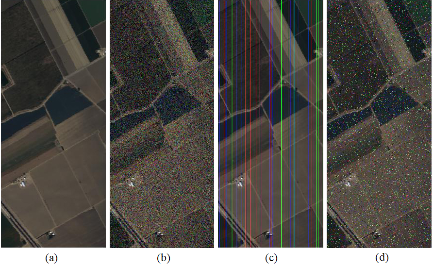

# Robustness of Convolutional Neural Network Models in Hyperspectral Noisy Datasets with Loss Functions

The presence of noise in images affect Convolutional Neural Networks (CNNs) classification performance. In addition, loss function plays an important role in robustness of CNN model to noise.

The robustness of CNN model is investigated by using Cross-Entropy, Pseudo-Huber and Correntropy Loss functions on noisy data with different levels of noise.
The experiments are performed using Xception CNN architecture on Pavia University and Salinas Scene datasets. Some common noises in hyperspectral images such as Gaussian, Stripe and Salt and Pepper is applied to test data, and the classification results with different loss functions are compared. In order to reduce training time and prevent overfitting, hyperspectral pixel to image sampling method is proposed.

Fig: The RGB part of the Pavia University hyperspectral image and the presence of different noises. (a) Noiseless. (b) Gaussian. (c) Stripe. (d) Salt & Pepper.

Fig.2: The RGB part of the Salinas Scene hyperspectral image and the presence of different noises. (a) Noiseless. (b) Gaussian. (c) Stripe. (d) Salt & Pepper.

Fig.3: Proposed pixel to image sampling method for (a) Pavia university and (b) Salinas scene datasets

Fig.4: Investigation of CNN model robustness framework

Description of the repository for each dataset folders:
-------------------------------------------------------
### Pavia university:
1) Run Pavia_pix2img.m with Matlab to make pixel to image hyperspectral data, with different levels of noises
2) Run Pavia_train_test_split.py with python to split datas into train and test folders
3) Run Pavia_CrossEntropy.py , Pavia_Correntropy.py and Pavia_PseudoHuber.py to train transfer learning Xception model with noiseless data and evaluate on Gaussian, Salt & Pepper and Stripe noise with levels of 0, 5%, 10%, 15%, 20% and 25% of noise.

### Salinas scene:
1) Run Salinas_pix2img.m with Matlab to make pixel to image hyperspectral data, with different levels of noises
2) Run Salinas_train_test_split.py with python to split datas into train and test folders
3) Run Salinas_CrossEntropy.py , Salinas_Correntropy.py and Salinas_PseudoHuber.py to train transfer learning Xception model with noiseless data and evaluate on Gaussian, Salt & Pepper and Stripe noises with levels of 0, 5%, 10%, 15%, 20% and 25% of noise.

Results will save under "Results" folder for 50 runs. Because of getting different result in each run, it is better to average results of multipe runs to discuss about the effect of each loss function.

PaviaU.mat, PaviaU_gt.mat,Salinas_corrected.mat and Salinas_gt.mat were downloaded from (http://www.ehu.eus/ccwintco/index.php/Hyperspectral_Remote_Sensing_Scenes)

## Prerequisites

- [Anaconda 4.8+](https://www.anaconda.com/download/)
- [tensorflow-gpu 2.0+](https://anaconda.org/anaconda/tensorflow-gpu)
- [Matlab 2017+](https://www.mathworks.com/products/matlab.html)
- [CUDA v10.0](https://developer.nvidia.com/cuda-10.0-download-archive)
- [cuDNN v7.6.4 for CUDA 10.0](https://developer.nvidia.com/rdp/cudnn-archive)
- 7GB of hard drive

## Hardware used
The convolutional neural networks were trained on a machine with Intel Core i5-7400 CPU, 8 GB RAM and NVIDIA GeForce GTX 1060 6GB GPU.